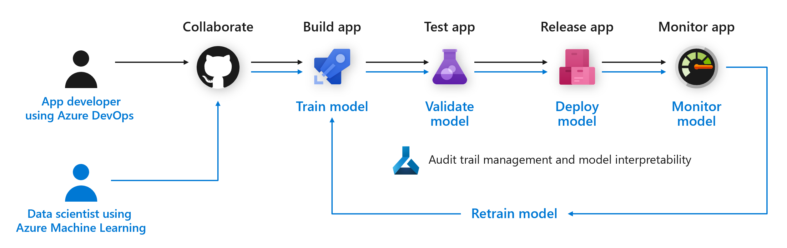
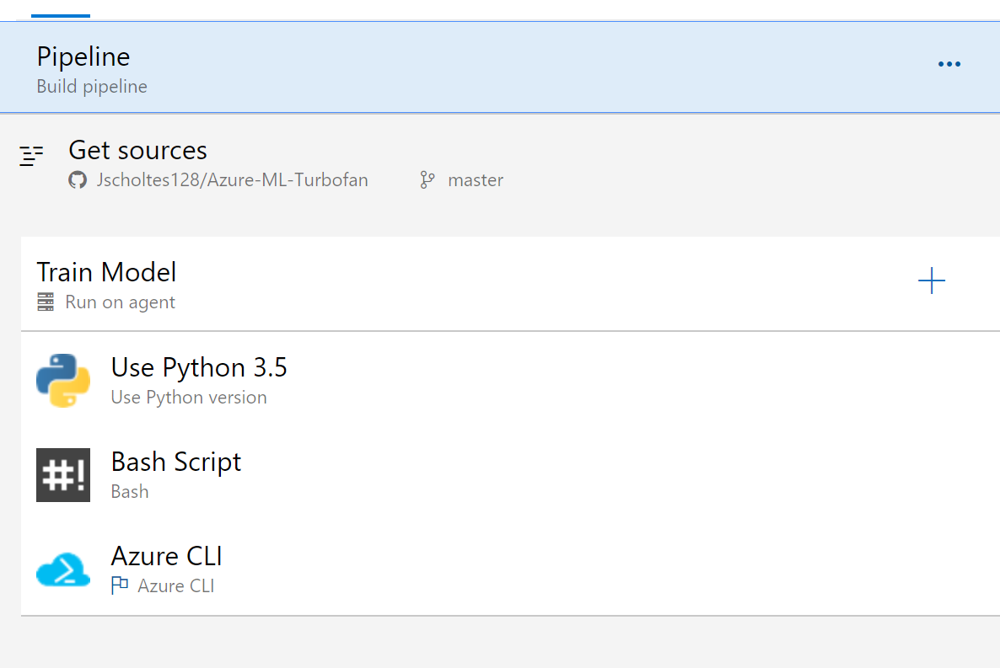
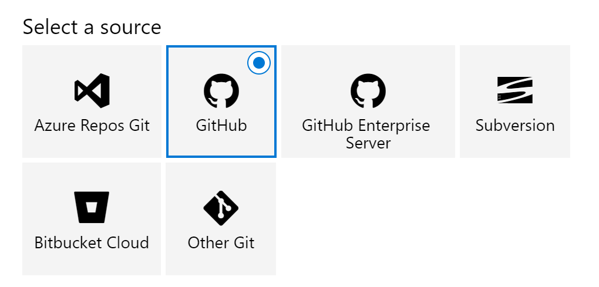
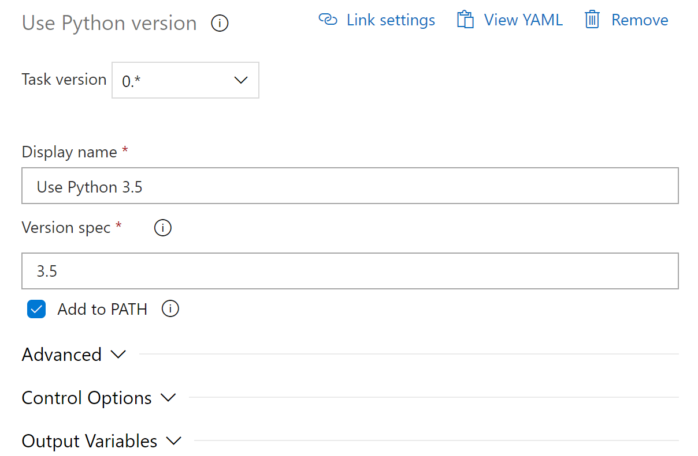
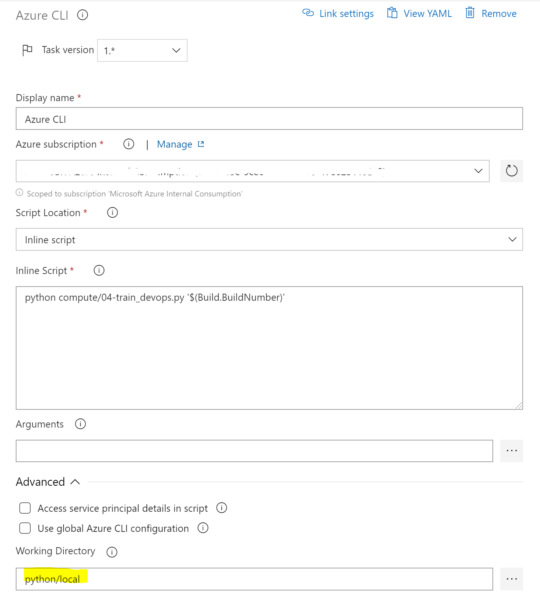
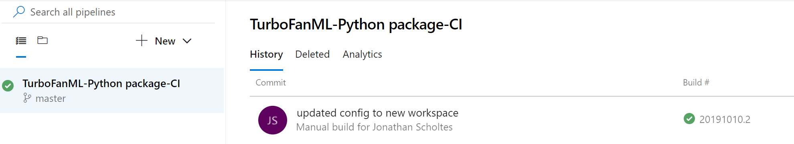

## Azure Machine Learning DevOps (MLOPs)

Use [Azure Pipeline](https://azure.microsoft.com/en-us/services/devops/pipelines/) to automatically train and deploy machine learning models with Azure Machine Learning Service.
This example demonstrates a build pipeline to train a model on code check-in to GitHub.

## Prerequisites
Before you read this topic, you should understand [how the Azure Machine Learning service works.](https://docs.microsoft.com/en-us/azure/machine-learning/service/concept-azure-machine-learning-architecture)

Review the [Azure Machine Learning Service CI\CD How-to Guide](https://docs.microsoft.com/en-us/azure/devops/pipelines/targets/azure-machine-learning?context=azure%2Fmachine-learning%2Fservice%2Fcontext%2Fml-context&view=azure-devops&tabs=yaml)

The CI/CD Pipele in this example re-trains uses the file:
- [01-train.py](01-train.py)

### Azure DevOps Pipeline

The [Azure Machine Learning Service CI\CD How-to Guide](https://docs.microsoft.com/en-us/azure/devops/pipelines/targets/azure-machine-learning?context=azure%2Fmachine-learning%2Fservice%2Fcontext%2Fml-context&view=azure-devops&tabs=yaml) offers futher details into the following steps:

#### Build Pipeline
simple pipeline that checks-out the code from GitHub, sets-up training environment then runs the training python script.

### Source Control Integration
DevOps can integrate with different source control for triggering builds and checking-out code. 

### Python Environment
This build is using python 3.5.

### Bash script to set-up environment
The install requirments script will install the Azure CLI and pip install packages with requirements text file. The run location is important as the bash script needs access to the additional configuration files.

### Training
The training script uses the Azure CLI authentication to access Azure Machine Learning Workspace without the interactive authentication. The training script will use the build number as a tag in the AML experiment. 

### Completed Runs

